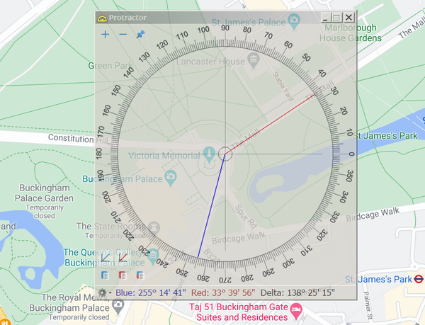

# Protractor

A simple C# (Windows Forms) application for measuring angles between any objects on the screen.

You can download the executable file `Protractor.exe` on the [release page](https://github.com/ap13ski/Protractor/releases/tag/v1.1). 

You may need to [install](https://www.microsoft.com/en-us/download/details.aspx?id=49982) `.NET Framework 4.6.1` to run the program as well ([mirror](https://github.com/ap13ski/Protractor/releases/download/v1.0/default.NET_Runtime_Pack_Offline_Installer_NDP461-KB3102436-x86-x64-AllOS-ENU.exe)).

Visual Studio 2015, .NET Framework 4.6.1

How to get started using Protractor:
- [x] Activate the Blue support line (BSL) and/or the Red support line (RSL) using their corresponding switches in the lower-left corner of the window or press **[1]** or **[2]**. The angle values will be displayed on the status bar.
- [x] To position the BSL (the RSL), click and hold the **left (right) mouse button** anywhere in the window. For greater precision, you can release the mouse button **anywhere** on the screen, including the area outside the window.
- [x] Adjust the window opacity using the mouse wheel. Press **[T]** to toggle **Always on top** mode.
- [x] Use the gear icon button on the status bar or press **[U]** to toggle the angle value units. Press **[A]** to set angular units (d° m' s"), press **[D]** to set decimal units (d,nnn°). This menu also allows you to set fixed angle values of the support lines.
- [x] Copy the angle values using the buttons in the lower-left corner of the window, located below the BSL and the RSL switches, or with **[X]**, **[C]**, **[V]**.
- [x] Move the window with the arrow keys **[↑]**, **[↓]**, **[←]**, **[→]** by 1 px. Hold **[Ctrl]** or **[Alt]** to move the window by 10 px or 50 px, respectively. Press **[Home]** to center the window on the screen.

Hope you enjoy Protractor!
Feel free to email your feedback and suggestions to `ap13ski@gmail.com`.